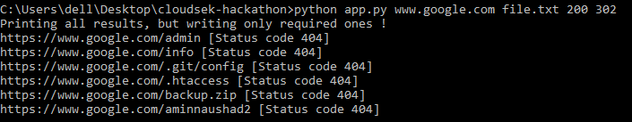
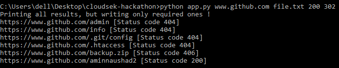
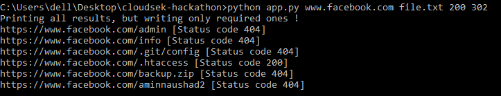

# Cloudsek [](https://www.python.org/)   [](https://www.python.org/)

## Problem Statement: Build a minimal web path bruteforcer: Optimised memory, CPU usage

### The CLI interface to the web path bruteforcer should accept these from the user:
<ul> <li>webapp url</li>
<li>A file containing a list of webapp paths that need to be brute forced against the specified webapp url [Minimum paths: 1000]<br>
Sample wordlist: Link </li>
<li>List of success status code: (default: [200])</li>
</ul>
<h3> Sample Input:</h3>

Webapp url: https://www.github.com<br>
Webapp paths: sample 5 lines out of 1000 of the input file wordlist.txt
<ul><li>admin</li>
<li>info</li>
<li> .git/config</li>
<li> .htaccess </li>
<li>backup.zip
</li></ul>

Success status codes: [200, 302]


### ABOUT
```
First approach
This project takes:
1.	A website URL which is needed to be checked
2.	A file which contains completing URLs

•	Website URL then takes contents from file(file.txt) and append it to complete the URL.
•	Then using the code it pings to the site to check the success code.
•	We are checking all the sites in completed URL but only printing which one are required.
•	Then gives output on CLI

How it works:
•	Placeholder variable declaration: we are reading data from a file which needs placeholder variables

•	Function to generate url from input and word : This function is appending the website url with the contents of file.txt to complete the URL


•	Possible multithread function: A possible approach

•	Processing and filling variables:  We have made all the URLs and saved it in a list 


•	Handling main action: This is accepting the list of URLs and then by using request library we are pinging the websites URL and checking for status codes and storing the output in output.txt

•	Writing final output: We are showing pinged site with the status code

Optimized Approach:
•	We used multithreading for this approach to make our code faster as our first approach was slower.
•	Multithreading executes the different parts simultaneously by taking parts of the programs which are independent.
•	It is a major optimization over the first approach.
•	Basic parts of the project remains the same which are:
o	Taking inputs 
o	Creating placeholder variables
o	Merging URLs
o	Then providing outputs


```
## Usage:
```
python app.py [url] [word file] [status code]
```

### Example
```
python app.py www.github.com file.txt 200 302
```
## Output
<div align="center">
  <h3 align='left'>Test 1  www.google.com</h3>
  <hr>
  
</div><br><br>
<div align="center">
  <h3 align='left'>Test 2  www.github.com</h3>
  <hr>
  
</div><br><br>
<div align="center">
  <h3 align='left'>Test 3  www.facebook.com</h3>
  <hr>
  
</div><br><br>

